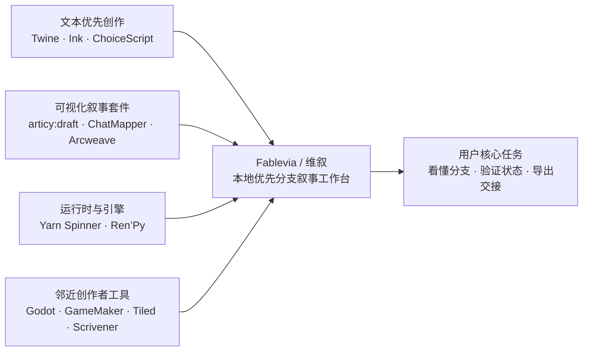

# Fablevia 竞品与客户调研报告（2026-08）

> 检索日期：2026-08-12  
> 品牌口径：维叙 / Fablevia；PlotFlow 仅作技术命名空间。  
> 证据标记：**F** = 官网/官方文档事实；**F0** = PlotFlow 当前项目基线；**U** = 重复出现的公开第一人称用户证据；**H** = 设计假设或策略建议。  
> 价格、平台、版本和 CTA 均仅代表截至 2026-08-12 的页面口径。

## 一、执行摘要与研究方法

### 核心结论

Fablevia 最有机会占据的位置，不是“另一个写作软件”或“另一个游戏引擎”，而是：

> **让独立开发者在进入引擎之前，看懂、整理、验证并交接自己的分支叙事。**

竞品和用户证据共同指向五个高价值问题：

1. **分支一多就难以整体理解。** 用户反复寻找节点图、章节分组、汇合结构和批量整理能力。[U：节点可视化需求](https://www.reddit.com/r/interactivefiction/comments/1n219kn/node_visualizer_for_an_interactive_fiction/)、[U：StoryFlow 用户评价](https://steamcommunity.com/app/4088380/reviews/?browsefilter=toprated&l=french)
2. **文本创作与最终演出之间存在断链。** 图片、字体、存档、状态、说话人、暂停点和引擎变量经常需要二次处理。[U：Twine 资源导出](https://www.reddit.com/r/twinegames/comments/1gxgt4j/pointing_to_a_font_in_my_folder_preview_vs_export/)、[U：Ink 状态与运行时](https://github.com/inkle/ink/discussions/784)
3. **用户希望低摩擦地从故事走到可玩原型。** “编辑→检查→试玩→导出”比单纯的写作能力更有购买理由。[U：StoryFlow 用户评价](https://steamcommunity.com/app/4088380/reviews/?browsefilter=toprated&l=french)、[U：Yarn Spinner 开发日志](https://itch.io/devlog/1519614/npcs-and-dialogue-system-1005.amp)
4. **文件所有权和迁移能力是信任证据。** 用户担心平台锁定、重写返工、资源路径失效和引擎更换成本。[U：Twine 迁移讨论](https://www.reddit.com/r/twinegames/comments/1oqs8gr/using_twine_for_game_development/)、[U：中文开发日志](https://www.bilibili.com/video/BV1xPQ8BXEzR/)
5. **买断与离线优先本身就是定位差异。** articy:draft X、Arcweave、ChatMapper 的订阅或云端边界，使“本地文件、无强制联网、一次性商业概念”具备清晰区隔。[F：articy:draft X](https://www.articy.com/en/support/frequently-asked-questions/)、[F：Arcweave Pricing](https://arcweave.com/pricing)、[F：ChatMapper Pricing](https://www.chatmapper.com/pricing/)

### 研究范围

| 通道 | 记录数 | 去重来源数 | 样本范围 |
|---|---:|---:|---|
| 直接竞品官网 | 8 | 24 | Twine、Ink/Inky、articy:draft、ChatMapper、Yarn Spinner、Arcweave、Ren’Py、ChoiceScript |
| 邻近创作者工具官网 | 8 | 24 | Godot、GameMaker、Construct、RPG Maker、Aseprite、Tiled、Obsidian、Scrivener |
| 英文客户声音 | 40 | 33 | Reddit、GitHub Discussions、itch.io、Steam |
| 中文客户声音 | 10 | 10 | B 站公开开发日志/动态 |
| 合计 | 68 | 91 | 仅使用已提供的官方页面与公开第一人称记录 |

### 方法与证据边界

- 竞品事实只采用官网、官方文档和官方 GitHub。
- 客户声音只采用公开第一人称内容，优先记录具体使用情境、阻力和任务目标。
- 重复 URL 已去重；Steam 样本主要集中于 StoryFlow Editor，不能视为整个 Steam 叙事工具市场的代表。
- 中文样本全部来自 B 站公开作者日志/动态，无法外推完整中文市场。
- 未登录用户后台、未购买产品、未下载或安装软件。
- 未将旧文档、第三方评论、社区传言当作当前产品事实。

## 二、当前产品事实与未来商业概念边界

以下是本轮研究采用的 PlotFlow / Fablevia 项目事实基线。它们来自当前项目，不等同于公开官网已验证事实。

| 项目事实 | 当前口径 | 标记 |
|---|---|---|
| 品牌 | 维叙 / Fablevia | F0 |
| 技术命名空间 | PlotFlow | F0 |
| 产品形态 | 本地优先叙事分支桌面工作台 | F0 |
| 默认入口 | Graph Lab | F0 |
| 磁盘真相源 | `.mdstory` 纯文本文件 | F0 |
| 导出目标 | JSON / HTML / TXT | F0 |
| 引擎路径 | Godot 完整路径；其他引擎接口预留 | F0 |
| 公开下载/支付 | 当前仓库不等于已接入公开结账、购买或下载 | F0 |
| 诊断表述 | 只描述覆盖断链、死胡同、变量、类型和循环 | F0 |
| `$29 / Windows` | 仅为未来商业概念，不代表当前可购买或下载 | H |

官网不应把未来概念写成当前产品能力。尤其是“获取 Windows 版”“$29 买断”必须同时出现：

> **未来商业概念 / Future commercial concept — 当前不可购买或下载**

不得链接到不存在的结账页，不得伪造下载状态，也不得在产品截图中让用户误以为按钮已可用。

## 三、竞品类别图

| 类别 | 代表产品 | 用户获得的主要价值 | Fablevia 的区隔 |
|---|---|---|---|
| 文本优先互动叙事 | Twine、Ink/Inky、ChoiceScript | 快速写作、纯文本、低成本发布 | 默认图形工作区，同时保留完整 `.mdstory` |
| 专业可视化叙事套件 | articy:draft、ChatMapper | 对象、角色、对话树、模拟器、引擎导出 | 更轻量，减少对象数据库、服务器和订阅复杂度 |
| 运行时/引擎型工具 | Yarn Spinner、Ren’Py | 把脚本接入 Unity、Godot、Unreal 或直接做成游戏 | 站在引擎之前，先解决叙事结构与交接 |
| 云端协作叙事平台 | Arcweave | 在线协作、评论、本地化、AI、引擎导出 | 离线优先、文件归用户、无强制账户 |
| 邻近创作工具 | Godot、GameMaker、Tiled、Scrivener、Obsidian 等 | 引擎、地图、长文、知识库或素材制作 | 只聚焦分支叙事的理解、验证和导出 |

## 四、官网设计语义矩阵

### 4.1 直接竞品官网对比

| 产品 | Hero / 主张 | CTA | 页面叙事 | 真实产品证据 | 价格与平台（截至 2026-08-12） |
|---|---|---|---|---|---|
| [Twine](https://twinery.org/) | 开源、互动、非线性故事；强调无需代码起步 | Download desktop app、Reference | 定义产品→扩展变量/CSS/JS→下载与教程 | Passage map、桌面应用、故事格式 | 免费、开源；Windows/macOS/Linux 与浏览器；当前首页显示 Twine 2.12.0，2026-04-10 |
| [Ink/Inky](https://github.com/inkle/ink) | 互动故事叙事脚本语言 | Download Inky、Tutorial、Documentation | Getting started→语法→编译→部署 | 代码、示例文本、inklecate、Web 部署文档 | 免费/开源；具体许可证和当前版本本轮未核实 |
| [articy:draft X](https://www.articy.com/en/articydraft/try/) | 完整的游戏叙事生产工具 | Get articy:draft X FREE、Downloads | 免费入口→对象/分支→导出→升级 | 角色、对话、复杂分支、Unity/Unreal 资源 | FREE：无限项目、每项目 700 objects、商业权利；X 为订阅，无 perpetual license；Windows/macOS |
| [ChatMapper](https://www.chatmapper.com/) | 管理游戏故事线的全功能可视化编辑器 | Download Now、Play a Sample、Pricing | 角色→地点→道具→播放→导出 | 对话树、模拟器、Lua、变量、HTML/JSON/多格式导出 | Commercial $35/月年付或 $45/月；Team $110/$135；Indie $99 需符合条件；桌面 OS 未核实 |
| [Yarn Spinner](https://yarnspinner.dev/docs/get-started/) | 直接开始写互动对话 | 按引擎 Get Started、Try Yarn Spinner | 选引擎→选编辑器→语言→集成 | VS Code graph view、live preview、debugging、引擎插件 | 核心开源；组件按 MIT/YSPL；商业使用无 royalties/fees；Unity feature-complete，Godot/Unreal 部分 alpha |
| [Arcweave](https://arcweave.com/features) | 互动叙事的完整工具箱 | Start free、Create free account | 可视化→试玩→引擎→协作→本地化→AI→价格 | 节点编辑、Play Mode、可玩链接、JSON/CSV/XLSX/Markdown/PDF | Basic $0，3 projects/200 items，不可商业；Pro $15/member/月年付；Team $25/member/月年付；SaaS |
| [Ren’Py](https://www.renpy.org/) | 视觉小说引擎 | Download、Quickstart、Documentation | 下载→教程→部署→许可 | SDK、示例项目、教程、跨平台构建 | 免费，商业/非商业均可；主体 MIT，部分 LGPL；开发平台 Windows/macOS/Linux；首页摘要显示 8.5.3 |
| [ChoiceScript](https://www.choiceofgames.com/make-your-own-games/choicescript-intro/) | 简单的互动小说脚本语言 | Introduction、GitHub、Export and Publishing | 文件结构→变量/choice→测试→HTML/发布 | 纯文本 scene、命令示例、HTML 导出 | 工具许可与价格本轮未核实；需要 Node.js；可导出 HTML，官方提供移动/Steam 发布路径 |

### 4.2 邻近创作者工具对比

| 产品 | 可迁移官网语义 | 真实证据 | 价格/平台口径（截至 2026-08-12） | Fablevia 可借鉴点 |
|---|---|---|---|---|
| [Godot](https://godotengine.org/) | 免费、开源、跨平台游戏引擎 | 编辑器截图、功能文档、版本归档、MIT | 稳定页显示 4.7.1；免费 MIT；Windows/macOS/Linux/Android/Web，iOS 可运行导出；部分 C# Web/移动能力有限 | 首屏写清本地、开放格式和寿命；不要复制大而全引擎叙事 |
| [GameMaker](https://gamemaker.io/en) | 免费、快速、人人可用 | GML Visual/Code、编辑器、Showcase、LTS | Free 非商业；Professional FAQ 为 $99.99 一次性商业许可，动态价格未完整核实；Windows/Mac/Ubuntu 下载；首次运行需联网登录 | 用“非程序员起步→逐渐深入”的双路径 |
| [Construct](https://www.construct.net/en/make-games/buy-construct) | 浏览器内快速创作、无需代码 | Demo、功能对照、用户规模 | Personal $15.99/月或 $129.99/年；Startup $168.99/席位/年；无版税；完整平台兼容和退款未核实 | 免费试用→差异表→透明价格的连续叙事 |
| [RPG Maker](https://www.rpgmakerweb.com/products) | 任何人都能轻松制作 RPG | 地图、事件、素材、免费游戏包、论坛 | MZ/MV $79.99；VX Ace $69.99；VX $59.99；MZ/MV 支持 Windows/Mac；试用时长在官方页面出现 20/30 天冲突 | 用“完成第一条可玩路径”降低门槛 |
| [Aseprite](https://www.aseprite.org/) | 动画精灵编辑器与像素艺术工具 | 真实编辑器截图、时间轴、像素工具 | $19.99 起；Windows installer/portable、macOS、Ubuntu、Steam；可更新至 v1.9；商业制作素材允许；退款依第三方支付规则，三个月后不能申请 | 让编辑器本身成为视觉证据；明确本地包和更新范围 |
| [Tiled](https://www.mapeditor.org/) | 免费、开源、易用、灵活的地图编辑器 | 地图、对象层、真实作品、源码、导出 | 1.12.2 于 2026-05-27 发布；GitHub Releases/itch.io，支持主要 OS；组件存在多种许可证 | 展示可理解文件格式、真实作品和导出适配器 |
| [Obsidian](https://obsidian.md/?helpref=hc_fnav) | 本地 Markdown、链接、插件、思考空间 | Markdown、Graph、Canvas、帮助文档、插件生态 | 永久免费；无需账户下载；数据默认本地、用户拥有内容；Windows/macOS/Linux/iOS/Android；Sync/Publish 为可选服务，价格本轮未核实 | “文件归用户、同步是可选项”是最强信任语义 |
| [Scrivener](https://www.literatureandlatte.com/scrivener/overview) | 长篇写作、小说、剧本和漫画工作空间 | Binder、Corkboard、Synopsis、Compile | 桌面实际使用 30 天试用；macOS 11+、Windows 10+ 64-bit、iOS 11+；iOS 显示 $23.99；桌面动态价格未核实 | 先展示工作台，再解释抽象模型 |

### 4.3 官网设计语义归纳

| 维度 | 竞品共性 | Fablevia 建议 |
|---|---|---|
| Hero | 最有效的 Hero 直接说结果，而非罗列功能 | “看懂分支、验证路径，把故事交给引擎” |
| CTA | 免费/开源工具把 Download 放首屏；买断工具把试用/购买放近处 | 当前只使用 View Graph Lab、Open sample、Read `.mdstory`；未来购买 CTA 必须禁用并标注 |
| 页面叙事 | 价值主张→真实工作台→样例→价格/许可→下载/购买 | 采用“看懂→编辑→检查→导出→交接”的闭环 |
| 截图 | Aseprite、Tiled、Scrivener、Obsidian 等都把真实界面当作证据 | 使用真实 Graph Lab、Inspector、Source Drawer、导出结果，不使用无法对应功能的 3D mockup |
| 本地与所有权 | Godot、Tiled、Obsidian、Aseprite 通过格式、源码、离线包降低锁定焦虑 | 首屏后明确 `.mdstory` 是文件真相源，JSON/HTML/TXT 可带走 |
| 学习成本 | RPG Maker、Construct、GameMaker 通过第一步体验和渐进式入口降低门槛 | 给出“第一条分支”的三步演示，并保留完整源码投影 |
| 信任 | 版本归档、文档、真实作品、许可和导出结果比抽象口号更有效 | 展示样例文件、诊断状态、导出文件结构和 Godot 交接路径 |
| 视觉方向 | 工具类官网偏编辑器证据；写作类偏纸张、卡片、专注 | 采用亮色默认、纸张暖色、流程图节点和少量语义色 |
| 价格 | 订阅产品强调分层限制；买断产品强调试用、更新和许可 | 未来商业概念只做静态说明，不伪造当前结账 |

## 五、中英文客户声音主题

### 5.1 样本覆盖

| 维度 | 英文样本 | 中文样本 |
|---|---|---|
| 记录数 | 40 | 10 |
| 去重来源 | 33 | 10 |
| 时间 | 2022–2026 | 2022–2026 |
| 平台 | Reddit 10、GitHub 10、itch.io 10、Steam 10 | B 站视频 9、B 站动态 1 |
| 主要偏差 | Steam 样本集中 StoryFlow Editor；articy 近期直接用户记录不足 | 全部来自能持续发布开发日志的独立开发者 |
| 可靠性限制 | 公开第一人称，不代表市场比例 | 2 条为 B 级公开索引片段；知乎、Indienova、中文 Godot/Unity 社区和公开 GitHub 中文记录缺失 |

### 5.2 主题频次

频次是多标签记录数，不是市场份额，也不能直接外推总体用户比例。

| 主题 | 英文 | 中文 | 综合判断 |
|---|---:|---:|---|
| 引擎接入 | 18 | 4 | 最高优先级问题 |
| 学习成本 | 17 | 3 | 最高优先级问题 |
| 分支失控/结构化 | 11 | 4 | 核心产品机会 |
| 文本/图形取舍 | 11 | 2 | Graph Lab 的主要价值来源 |
| 迁移阻力 | 10 | 4 | 文件和导出可信度必须前置 |
| 本地文件/数据整理 | 8 | 2 | 本地真相源是购买信任 |
| 协作/联机 | 7 | 3 | 需要轻量交接，不宜先做云端团队系统 |
| 价格/时间/发布门槛 | 5 | 1 | 买断与低风险试用是辅助卖点 |

### 5.3 反复出现的用户问题

#### A. “我看不见整个故事”

用户想把脑中的复杂分支变成可移动、可分组、可检查的结构。

- “see a big picture map”——希望看到全局节点图。[U](https://www.reddit.com/r/interactivefiction/comments/1n219kn/node_visualizer_for_an_interactive_fiction/)
- “room for something a bit more visual”——纯文本对部分作者不够直观。[U](https://www.reddit.com/r/interactivefiction/comments/1kyumzk/finally_made_the_tool_i_wish_existed_when_i/)
- “Finally my branching story doesn't look like spaghetti in my head”——节点图直接降低分支认知负担。[U](https://steamcommunity.com/app/4088380/reviews/?browsefilter=toprated&l=french)
- 中文用户持续讨论多身份、多分支、剧情树和全面改版。[U](https://www.bilibili.com/video/BV14uGazSEiw/)、[U](https://www.bilibili.com/video/BV1rAVZ6YEJ2/)

#### B. “我不想在写作和引擎之间重做一遍”

用户通常接受“文本逻辑”和“图形引擎”分工，但要求结构能够交接。

- “best of both worlds”——Ink 负责叙事，Unity 负责图形和运行时。[U](https://itch.io/devlog/1314578/monthly-developers-log-1.amp)
- Ink 用户反复询问 Godot、LibGDX、DLL/FFI 和其他引擎接入。[U](https://github.com/inkle/ink/discussions/913)、[U](https://github.com/inkle/ink/discussions/903)
- Yarn 用户需要让对话命令控制 NPC、位置和场景状态。[U](https://itch.io/devlog/1522967/playable-prototype.amp)
- 中文用户提到复杂剧情自动解析、Naninovel 导入和 Unity/UE5 资产接入。[U](https://www.bilibili.com/video/BV1ZkHuzcEUj/)、[U](https://www.bilibili.com/video/BV1xPQ8BXEzR/)

#### C. “预览能跑，不代表交付能跑”

用户最担心的不是有没有导出按钮，而是导出后图片、字体、状态和布局是否仍然有效。

- Twine 预览正常、发布后图片不显示。[U](https://www.reddit.com/r/twinegames/comments/1hoat6p/image_dont_display/)
- 本地字体在预览中有效，上传 itch.io 后失效。[U](https://www.reddit.com/r/twinegames/comments/1gxgt4j/pointing_to_a_font_in_my_folder_preview_vs_export/)
- 用户希望从节点编辑器一键导出独立桌面应用。[U](https://steamcommunity.com/app/4088380)
- Ink 用户遇到存档后标签历史丢失、外部函数重启故事和运行时状态边界问题。[U](https://github.com/inkle/ink/discussions/784)、[U](https://github.com/inkle/ink/discussions/965)

#### D. “工具不能比写作本身更累”

用户愿意学习，但需要快速看到可玩结果。

- “the one with the least friction”——低摩擦是选择编辑器的重要理由。[U](https://steamcommunity.com/app/4088380/reviews/?browsefilter=toprated&l=french)
- “I lack the technical knowledge”——复杂叙事创作者需要把想法转成低代码步骤。[U](https://itch.io/devlog/1532217/devlog-1-exploring-the-twine-cookbook.amp)
- Yarn Spinner 被认为直观、可扩展，但仍需要学习时间。[U](https://itch.io/devlog/1519614/npcs-and-dialogue-system-1005.amp)
- 中文开发日志反复表现出程序、美术、动画、代码整理并行带来的疲劳。[U](https://www.bilibili.com/video/BV1bptBeSEvs/)、[U](https://www.bilibili.com/video/BV1Y5411q7LW/)

#### E. “我不想因为改方向而丢掉资产”

用户在大型重写、文件移动、引擎转换和项目迁移时，对结构可恢复性非常敏感。

- Twine 大型项目重写会牵动世界观、路线和团队规模。[U](https://itch.io/blog/845212/devlog051224)
- 用户希望跨项目迁移玩家状态，而不是手工重新列变量。[U](https://www.reddit.com/r/twinegames/comments/1cf2wak)
- “I came from articy with a large project”对应的核心诉求是摆脱订阅并保住项目资产。[U](https://steamcommunity.com/app/4088380)
- 中文开发日志记录了移动文件夹后进度倒退、全面改版和剧情迁移压力。[U](https://www.bilibili.com/video/BV1xPQ8BXEzR/)、[U](https://www.bilibili.com/video/BV1rAVZ6YEJ2/)

## 六、Jobs-to-be-Done

| 优先级 | 用户任务 | 证据 | Fablevia 应展示的结果 |
|---|---|---|---|
| 核心 | 当分支变多时，我要看懂整张故事图 | U：节点可视化、StoryFlow、Twine 大型项目 | Graph Lab 全局图、节点分组、汇合路径 |
| 核心 | 当我有一个想法时，我要快速做出第一条可玩路径 | U：Twine、Yarn、StoryFlow、ChoiceScript | 三步示例：建节点→加选项→试玩 |
| 核心 | 当我要交给程序或引擎时，我要保留结构而不是重做 | U：Ink/Godot/Unity/Yarn/Naninovel | `.mdstory`、JSON、Godot 交接示例 |
| 核心 | 当资源和状态复杂时，我要知道交付是否会断 | U：图片、字体、存档、状态问题 | 覆盖断链、死胡同、变量、类型、循环诊断 |
| 次要 | 当项目重写时，我要保住已有内容 | U：Twine、中文改版、Steam 迁移 | 纯文本真相源、版本可读性、Source Drawer |
| 次要 | 当我不会编程时，我要从可视化入口开始 | U：RPG Maker/Twine/ChoiceScript/中文独立开发者 | 图形化编辑、低代码条件、即时反馈 |
| 次要 | 当我和程序、美术或其他作者协作时，我要减少口头交接 | U：协作、联机、节点标签需求 | 导出文件、节点语义、可读结构 |
| 不优先 | 当我需要云端多人管理、AI、本地化和企业权限时，我要完整 SaaS | F：Arcweave 已占据该方向；H：Fablevia 应保持聚焦 | 暂不把云端协作作为首屏主张 |

## 七、核心、次要与不应优先服务的人群

### 7.1 核心人群

**独立游戏开发者中的叙事设计者、编剧和小团队负责人。**

- 正在制作视觉小说、互动小说、分支剧情或对话驱动游戏。
- 需要在引擎前整理剧情，或者已经使用 Unity、Godot、Unreal、Naninovel 等引擎。
- 不希望从纯代码开始，也不希望被复杂的对象数据库和服务器系统压住。
- 需要本地文件、可读源文本、结构化导出和低风险迁移。

证据优先级：**U 高**。英文样本中引擎接入、学习成本、分支失控和迁移阻力均反复出现；中文样本也持续出现复杂分支、程序/美术负担和迁移问题。

### 7.2 次要人群

1. **技术型叙事设计师和程序员。** 他们接受纯文本和脚本，但需要图形检查、补全、导出和引擎交接。[U](https://github.com/inkle/ink/discussions/903)
2. **第一次做分支叙事的独立作者、学生和教学场景。** 他们需要低摩擦的第一条路径、样例和可撤回的发布方式。[U](https://starecross.itch.io/always-my-sister)
3. **从文本工具迁移到更强可视化工作流的作者。** 他们已经理解 Twine/Ink 的基本概念，但希望降低大型项目管理成本。[U](https://steamcommunity.com/app/4088380/reviews/?browsefilter=toprated&l=french)

### 7.3 不应优先服务的人群

- 需要完整 2D/3D 场景、动画、资产制作和运行时编辑器的人。
- 需要云端实时协作、企业权限、AI 本地化和大规模对象数据库的团队。
- 只想要最终运行时引擎，不需要叙事规划和结构检查的人。
- 只接受浏览器 SaaS、账户协作和平台托管的人。
- 只想要复古 RPG 素材或像素绘图工具的人。

判断依据：**F + U + H**。这些方向已有 Godot、Arcweave、articy、Aseprite、RPG Maker 等更强产品占据；Fablevia 应先把“分支叙事结构工作台”做深。

## 八、从认知到购买、安装、学习、交接的决策路径

| 阶段 | 用户心里问题 | 页面必须给出的证据 | 当前/未来 CTA |
|---|---|---|---|
| 认知 | 这是不是解决分支混乱的工具？ | 一句话定位、真实 Graph Lab 图、分支前后对比 | 当前：View Graph Lab / 查看 Graph Lab |
| 评估 | 它比 Twine、Ink 或 articy 多解决什么？ | 文本与图形双投影、诊断、`.mdstory`、导出路径 | 当前：Open sample / 打开示例 |
| 试用理解 | 我能否在几分钟内做出一条路径？ | 三步演示、最小 `.mdstory`、试玩结果 | 当前：Read the sample / 阅读示例 |
| 风险判断 | 文件会不会被锁住？交付会不会断？ | 文件格式、JSON/HTML/TXT、资源路径、状态和变量说明 | 当前：See file format / 查看文件格式 |
| 购买判断 | 我是否需要付费？是否要订阅？ | 未来买断概念必须标注为未开放；不能伪造当前价格 | 未来：`$29 / Windows` 静态概念，不可购买 |
| 安装 | 能否离线运行？支持什么平台？ | 只有已有真实下载能力后才能写 Download；当前不得暗示已开放下载 | 当前不提供可执行下载 CTA |
| 学习 | 我会不会被语法或图形工具卡住？ | Graph Lab、Source Drawer、条件编辑、补全和错误反馈 | 当前：View tutorial / 查看教程 |
| 交接 | 程序员能否拿到干净数据？ | JSON 示例、Godot 路径、可读 `.mdstory` | 当前：View export example / 查看导出示例 |
| 发布 | 最终作品能否独立运行？ | 只展示已具备、可验证的导出证据；未来能力不得写成现状 | 未来概念必须有状态说明 |

## 九、用户原话、常见反对意见与必须展示的产品证据

### 9.1 代表性短引文

| 用户原话 | 说明 | 来源 |
|---|---|---|
| “see a big picture map” | 需要全局理解分支 | [Reddit](https://www.reddit.com/r/interactivefiction/comments/1n219kn/node_visualizer_for_an_interactive_fiction/) |
| “room for something a bit more visual” | 纯文本对部分作者不够直观 | [Reddit](https://www.reddit.com/r/interactivefiction/comments/1kyumzk/finally_made_the_tool_i_wish_existed_when_i/) |
| “the one with the least friction” | 低摩擦是选型理由 | [Steam](https://steamcommunity.com/app/4088380/reviews/?browsefilter=toprated&l=french) |
| “I lack the technical knowledge” | 需要把复杂想法转成可执行步骤 | [itch.io](https://itch.io/devlog/1532217/devlog-1-exploring-the-twine-cookbook.amp) |
| “best of both worlds” | 文本逻辑与图形引擎分工 | [itch.io](https://itch.io/devlog/1314578/monthly-developers-log-1.amp) |
| “one click exports a standalone desktop app” | 用户期待从编辑器直接得到可运行结果 | [Steam](https://steamcommunity.com/app/4088380) |
| “I came from articy with a large project” | 迁移与买断诉求 | [Steam](https://steamcommunity.com/app/4088380) |
| “复杂剧情分支无法自动识别” | 中文样本中的结构解析痛点 | [B 站](https://www.bilibili.com/video/BV1ZkHuzcEUj/) |
| “进度倒退一周，移动文件夹踩坑” | 文件与资产引用风险 | [B 站](https://www.bilibili.com/video/BV1xPQ8BXEzR/) |
| “开发日志并没有多少真正是玩家的人会看” | 内容曝光不等于购买转化 | [B 站](https://www.bilibili.com/video/BV1cv421r7kF/) |

### 9.2 常见反对意见与证据回应

| 反对意见 | 证据回应 | 证据级别 |
|---|---|---|
| “我已经有 Twine/Ink，不需要新工具。” | 展示 Graph Lab 如何读取同一类分支逻辑，并保留完整源码投影；重点卖结构理解、诊断和交接，不卖重新学习一套封闭语法。 | U + H |
| “图形工具最后还是要回到代码。” | 同屏展示节点、Inspector、Source Drawer 和 `.mdstory`；说明图形编辑只是投影，不替代文本真相源。 | F0 + H |
| “导出后图片、字体、状态可能失效。” | 展示资源路径、变量、类型、循环和覆盖断链检查；提供真实 HTML/JSON/TXT 输出样例。 | U + H |
| “我不想订阅一个编辑器。” | 当前不宣传已开放买断；未来 `$29 / Windows` 只能作为明确标注的商业概念。产品事实先强调本地文件和可迁移性。 | F0 + H |
| “我不想被某个引擎锁定。” | 展示 `.mdstory`、JSON 和 Godot 路径；其他引擎接口必须只写已具备的内容。 | U + F0 |
| “我没有时间学复杂软件。” | 三步第一条分支、真实示例、Graph Lab 默认入口、渐进式 Source Drawer。 | U + H |
| “团队成员看不懂我的结构。” | 展示节点标题、选项、变量、条件和导出文件的可读表达；不急于承诺云端协作。 | U + H |
| “你们是不是已经能下载和购买？” | CTA 内联明确写“未来商业概念 / Future commercial concept — 当前不可购买或下载”。 | F0 |

### 9.3 必须展示的产品证据

1. 真实 Graph Lab 大图，而非重绘的软件假界面。
2. 同一故事的节点、Inspector、Source Drawer 与 `.mdstory` 对应关系。
3. JSON / HTML / TXT 的真实输出片段。
4. 覆盖断链、死胡同、变量、类型与循环的诊断状态，不写有冲突的精确数量。
5. Godot 交接路径；Unity/Unreal 只写项目当前真实边界。
6. 可读纯文本、本地优先和无强制联网如何降低迁移风险。
7. 一个短小、可理解的样例故事，从第一条分支到导出结果。

## 十、对 `COMPETITIVE_ANALYSIS.md` 的更新与冲突

| 产品 | 官网已核实 | 旧文档需复核 | 本轮未核实 |
|---|---|---|---|
| Twine | 免费/开源、Web+桌面、Windows/macOS/Linux；首页显示 Twine 2.12.0，日期 2026-04-10 | 旧文档的 GPL v3 不应直接保留 | 当前许可证条款未在选定官方页面确认 |
| Ink/Inky | 免费/开源、文本优先、inklecate、官方教程和 Web 部署路径 | 旧文档的具体版本、MIT、Inky 0.15.2 需重查 | 当前版本、许可证细节、完整平台列表 |
| articy:draft X | 有 FREE 版；无限项目、每项目 700 objects、商业权利、所有导出；X 无 perpetual license、采用订阅 | 旧文档的 €200–400+、€300 单用户买断叙述应移除或标为历史 | 当前 X 付费金额；Linux 支持 |
| ChatMapper | Commercial $35/月年付或 $45/月；Team $110/$135；符合条件的 Indie $99；Trial 不得产生收入 | 旧文档“$99 买断”与当前官方定价冲突 | 具体桌面 OS |
| Yarn Spinner | 核心开源；组件使用 MIT/YSPL；商业使用无 royalties/fees；Unity feature-complete，Godot/Unreal 部分 alpha | 旧文档单一“MIT”表述需改为组件许可 | Yarn Spinner+ 当前价格 |
| Arcweave | Basic $0、3 projects/200 items、不可商业；Pro $15/member/月年付；Team $25/member/月年付；Enterprise custom | 旧文档 `$18–30/月` 是月付/年付混淆，应更新 | 完整导出能力与 Basic 各项限制；离线桌面版 |
| Ren’Py | 免费、商业可用、MIT/LGPL 组件、完整 SDK；首页摘要显示 8.5.3 | 旧文档若未纳入，应作为补充运行时竞品 | 各移动支持包的当前版本细节 |
| ChoiceScript | 官方教程、纯文本 scene、变量/choice、HTML 导出、移动/Steam 发布路径 | 旧文档若将其作为可视化竞品，应改为文本运行时补充 | 工具许可、价格、收入分成比例 |
| Godot | 免费、开源、MIT、跨平台、4.7.1 稳定页口径 | 旧文档若把 Godot 作为直接叙事工具，应改为邻近引擎 | 具体 C# Web/移动限制随版本变化 |
| GameMaker | Free 非商业；FAQ 给出 Professional $99.99 一次性商业许可；Windows/Mac/Ubuntu 下载；需首次联网登录 | 旧文档中的动态价格不应当作最终当前价 | 当前动态 Professional/Enterprise 价格 |
| Construct | Personal $15.99/月或 $129.99/年；Startup $168.99/年；无版税 | 旧文档若只写订阅价格，应补免费版限制和无版税口径 | 完整平台兼容、退款和试用细节 |
| RPG Maker | MZ/MV $79.99、VX Ace $69.99、VX $59.99；商业许可；Windows/Mac | 旧文档若写单一试用时长，应标记冲突 | 20 天与 30 天试用冲突的最终解释 |
| Aseprite | $19.99 起；Windows/macOS/Ubuntu/Steam；可更新至 v1.9；商业制作素材允许 | 旧文档若只写像素工具，应补本地包、更新和许可证据 | 具体退款平台规则 |
| Tiled | 免费开源、1.12.2 于 2026-05-27 发布、GitHub/itch.io 下载、跨平台 | 旧文档若写单一许可证，应改为组件许可证需逐项确认 | 所有组件许可证的完整边界 |
| Obsidian | 永久免费、无需账户下载、本地 Markdown、用户拥有内容、跨平台 | 旧文档若将其与云端笔记并列，应突出本地真相源 | Sync/Publish 当前价格和最低平台版本 |
| Scrivener | 桌面 30 天实际使用试用；Windows/macOS/iOS；买断许可；iOS $23.99 | 旧文档若将其作为纯文字编辑器，应补 Corkboard/Binder/Compile 语义 | 桌面当前动态价格、退款细节 |

## 十一、官网信息层级、文案、视觉语义与 CTA 建议

### 11.1 信息层级

1. **一句话结果：** 看懂分支，验证路径，把故事交给引擎。
2. **真实工作台：** Graph Lab、节点、Inspector、Source Drawer。
3. **双投影证据：** 同一 `.mdstory` 在图形与源文本中的对应关系。
4. **文件与交接：** `.mdstory`、JSON、HTML、TXT、Godot。
5. **风险解除：** 覆盖断链、死胡同、变量、类型、循环。
6. **商业边界：** 当前无公开购买/下载；未来 `$29 / Windows` 明确标注。

### 11.2 Hero 文案候选

中文：

> **把分支故事看清楚，再把它交给游戏引擎。**  
> 维叙是本地优先的叙事分支工作台：在 Graph Lab 里组织节点、检查路径，用可读的 `.mdstory` 保存真相，并导出干净的数据。

English：

> **See your branching story clearly. Hand it to your game engine cleanly.**  
> Fablevia is a local-first narrative workspace for mapping, checking, and exporting branching stories from a readable `.mdstory` source.

### 11.3 当前与未来 CTA

当前可用的探针内部导航：

- `查看 Graph Lab / View Graph Lab`
- `打开示例 / Open a sample`
- `阅读 .mdstory / Read the source format`
- `查看导出结果 / See the export`
- `查看 Godot 路径 / See the Godot path`

未来 CTA 只能使用以下状态：

> `获取 Windows 版 / Get Windows`  
> **未来商业概念 / Future commercial concept**  
> 当前不可购买或下载 / Not available for purchase or download

`$29` 必须与“未来商业概念”绑定，不得单独作为当前价格徽章。

## 十二、精确 Shape Brief：生长型剧本工作台

### 12.1 方向与设计系统

名称：**生长型剧本工作台 / The Growing Story Workbench**

固定配比：

- **50% 第一版 SaaS：** Hero、转化骨架、真实产品证据、工作流、信任、CTA 边界。
- **30% 剧本工坊：** 暖纸背景、剧本文稿层次、作者语气、轻微纸页错位。
- **20% 有机生态桌面：** Logo 分支骨架、彩色节点、路径生长与滚动点亮。

锁定 Token：

| Token | 值 / 用法 |
|---|---|
| `--paper-warm` | `oklch(0.96 0.025 82)`；页面画布和纸页 |
| `--branch-cobalt` | `oklch(0.52 0.19 260)`；主路径、主行动、焦点 |
| `--ink-earth` | `oklch(0.38 0.065 55)`；主文字 |
| `--node-leaf` | 叶绿；只用于节点与成功状态 |
| `--node-coral` | 珊瑚；只用于节点与诊断状态 |
| `--node-wheat` | 麦金；只用于节点、警告和时间线 |
| 标题 | `LXGW WenKai`，回退到中文衬线/楷体系统栈 |
| 正文 / UI | `Noto Sans SC`，回退到系统 sans-serif |
| 代码标签 | `Azeret Mono`，回退到系统 monospace |

版式：

- 主验证画布：`1440 × 1000`；次验证画布：`1280 × 900`。
- 内容最大宽度：`1240px`；左右安全边距在 1440 画布为 72–96px，在 1280 画布至少 48px。
- 4px 基础网格；间距阶梯：8 / 16 / 24 / 32 / 48 / 72 / 96px。
- 产品窗口保持端正；只允许背景纸页约 ±1.5° 的轻微错位。
- 不使用大量便签、气泡卡片、森林绿大色块、3D mockup 或伪造产品界面。

### 12.2 三个 PC 折页

#### 第一折：首屏与商业承诺

目标：5 秒内让访客明白 Fablevia 解决分支复杂度，而不是泛写作。

- 左侧价值主张，右侧真实 Graph Lab 大图。
- 中文默认，右上角完整 English 切换。
- 状态标签：`本地优先 · .mdstory 真相源 · JSON / HTML / TXT`。
- 主 CTA 视觉文案：`获取 Windows 版 / Get Windows`；紧邻 `$29 买断 / $29 one-time`。
- 该 CTA 是概念状态，点击后在按钮下方出现内联说明：`未来商业概念：当前不可购买或下载。`，不打开弹窗、不跳转伪链接。
- 次 CTA：`查看产品演示 / View product demo`，跳到第二折。
- 画布外永久标注：`未来商业概念稿，不代表已接入结账或下载。`

#### 第二折：同一故事源的双投影

目标：证明图形工作台和纯文本是同一故事的两个投影，而不是两套数据。

- 使用真实 Graph Lab、Inspector、Source Drawer 和 `.mdstory` 画面。
- 暖纸层次来自剧本工坊；钴蓝路径从画布节点连续连接到纯文本对应段落。
- 文案：`从节点图开始，也随时回到完整源码。 / Start with the graph. Return to the full source anytime.`
- 诊断只写：覆盖断链、死胡同、变量、类型与循环；不写精确条数。
- 只在滚动到本折时点亮对应节点，不持续循环。

#### 第三折：引擎交接与最终行动

目标：解除文件所有权、迁移、交接和未来购买疑虑。

- 连续路径：`Graph Lab → .mdstory → JSON / HTML / TXT → Godot`。
- 标出：本地优先、开放文本、Windows 与一次性买断概念。
- 主行动：`查看导出 / See the export`；次行动：`阅读示例 / Read the sample`。
- 最终未来 CTA 点击后以内联状态说明：`商业概念，结账与下载尚未接入。 / Commercial concept; checkout and download are not connected.`
- 不使用弹窗，不使用不可达链接，不显示虚构评价、下载量、合作方或用户规模。

### 12.3 中英文完整文案候选

| 中文 | English |
|---|---|
| 把分支故事看清楚，再把它交给游戏引擎。 | See your branching story clearly. Hand it to your game engine cleanly. |
| 本地优先的叙事分支工作台。 | A local-first workspace for branching narratives. |
| `.mdstory` 是你的故事真相源。 | `.mdstory` is your story’s source of truth. |
| 从节点图开始，也随时回到完整源码。 | Start with the graph. Return to the full source anytime. |
| 看见覆盖断链、死胡同、变量、类型和循环。 | See broken coverage, dead ends, variables, types, and loops. |
| 从第一条分支到可交接数据。 | From your first branch to handoff-ready data. |
| 获取 Windows 版 | Get Windows |
| `$29 买断` | `$29 one-time` |
| 查看产品演示 | View product demo |
| 查看导出结果 | See the export |
| 未来商业概念 | Future commercial concept |
| 当前不可购买或下载 | Not available for purchase or download |

### 12.4 真实资产映射

| 页面位置 | 本地真实资产 |
|---|---|
| 品牌 Logo | `网页/探针/assets/fablevia-icon.svg` |
| Hero Graph Lab | `网页/探针/assets/prism-foundry-1440x900.png` |
| 第二折基础窗口 | `网页/探针/assets/narrative-workbench-1280x720.png` |
| 引擎交接 | `网页/探针/assets/engine-telemetry-1280x720.png` |
| Source Drawer | `packages/app/e2e/theme-pack.e2e.spec.ts-snapshots/prism-foundry-source-open-1440x900-electron-win32.png` |
| 诊断状态 | `packages/app/e2e/theme-pack.e2e.spec.ts-snapshots/prism-foundry-diagnostics-1440x900-electron-win32.png` |

### 12.5 组件、交互、动效与无障碍

- 组件：BrandMarkGrowth、LanguageSwitcher、HeroStatement、GraphLabScreenshot、EvidencePill、DualProjection、SourceDrawerPreview、DiagnosticRail、ExportPath、GodotHandoff、FutureConceptCTA、TweaksPanel。
- Tweaks 面板关闭时从布局和无障碍树中完全隐藏；只提供“路径强度”和“动效开关”。
- 首次进入时分支线从 Logo 生长到产品截图；滚动时只点亮当前折节点。
- CTA / 边框过渡 180–240ms；不做大幅缩放、视差、自动视频或高频粒子。
- `prefers-reduced-motion: reduce` 时关闭生长、绘线和滚动点亮，保留静态路径。
- 不使用 `scrollIntoView`；折页导航用锚点或显式滚动位置逻辑。
- 所有状态同时使用文字、图标或形状，不只依赖颜色。
- 所有导航、语言切换、CTA 和 Tweaks 支持键盘；提供 `hover`、`focus-visible`、`active` 状态。
- 普通文本和交互控件达到 WCAG AA；截图提供具体替代文本。
- 未来 CTA 使用 `aria-describedby` 指向内联概念说明；不伪装成已可购买的 disabled 控件。

### 12.6 v0 后续文件与验收

Shape Brief 确认后，v0 才在 `网页/探针/最终候选/` 新建独立 `index.html`、`styles.css`、`app.js`、`brand-spec.md`、`README.md` 与本地资产副本；保留并不修改第一版 SaaS、剧本工坊和有机生态桌面原稿。

v0 至少完成完整首屏、后二折结构和核心证据；确认后再补全部文案、状态、动效、1440×1000 / 1280×900 截图及四向首屏对比图。

## 十三、来源索引

### 13.1 直接竞品官网与官方文档

- [Twine 官网](https://twinery.org/)
- [Twine Installing](https://twinery.org/reference/en/getting-started/installing.html)
- [Twine Reference](https://twinery.org/reference/en/)
- [Ink GitHub](https://github.com/inkle/ink)
- [Inky GitHub](https://github.com/inkle/inky)
- [Ink Documentation](https://get.ink/docs/)
- [articy:draft X FREE](https://www.articy.com/en/articydraft/try/)
- [articy Downloads](https://www.articy.com/en/downloads/)
- [articy FAQ](https://www.articy.com/en/support/frequently-asked-questions/)
- [ChatMapper 官网](https://www.chatmapper.com/)
- [ChatMapper Pricing](https://www.chatmapper.com/pricing/)
- [ChatMapper 1.5 Documentation（历史文档）](https://www.chatmapper.com/wp-content/uploads/dlm_uploads/2013/10/Chat-Mapper-1.5-Documentation.pdf)
- [Yarn Spinner Get Started](https://yarnspinner.dev/docs/get-started/)
- [Yarn Spinner Licensing FAQ](https://yarnspinner.dev/license/)
- [Yarn Spinner First Steps](https://yarnspinner.dev/docs/yarn/01-first-steps/)
- [Arcweave Features](https://arcweave.com/features)
- [Arcweave Pricing](https://arcweave.com/pricing)
- [Arcweave Share & Export](https://docs.arcweave.com/introduction/quick-tour/share-export)
- [Ren’Py 官网](https://www.renpy.org/)
- [Ren’Py Documentation](https://www.renpy.org/doc/html/index.html)
- [Ren’Py License](https://www.renpy.org/doc/html/license.html)
- [ChoiceScript Introduction](https://www.choiceofgames.com/make-your-own-games/choicescript-intro/)
- [ChoiceScript Exporting and Publishing](https://www.choiceofgames.com/make-your-own-games/exporting-and-publishing-your-game/)
- [ChoiceScript Advanced](https://www.choiceofgames.com/make-your-own-games/advanced/)

### 13.2 邻近创作者工具官网与官方文档

- [Godot 官网](https://godotengine.org/)
- [Godot Features](https://docs.godotengine.org/en/stable/about/list_of_features.html)
- [Godot FAQ](https://docs.godotengine.org/en/4.4/about/faq.html)
- [GameMaker 官网](https://gamemaker.io/en?cat=3)
- [GameMaker Features](https://gamemaker.io/en/features)
- [GameMaker Download](https://gamemaker.io/en/download)
- [Construct Buy](https://www.construct.net/en/make-games/buy-construct)
- [Construct Make Games](https://www.construct.net/en/make-games)
- [Construct Tutorials](https://www.construct.net/en/tutorials)
- [RPG Maker Products](https://www.rpgmakerweb.com/products)
- [RPG Maker FAQ](https://www.rpgmakerweb.com/faq)
- [RPG Maker Downloads](https://www.rpgmakerweb.com//downloads)
- [Aseprite 官网](https://www.aseprite.org/)
- [Aseprite Features](https://www.aseprite.org/features/)
- [Aseprite FAQ](https://www.aseprite.org/faq)
- [Tiled 官网](https://www.mapeditor.org/)
- [Tiled Download](https://www.mapeditor.org/download.html)
- [Tiled GitHub](https://github.com/mapeditor/tiled)
- [Obsidian 官网](https://obsidian.md/?helpref=hc_fnav)
- [Obsidian License](https://obsidian.md/ar/license)
- [Obsidian Help](https://obsidian.md/help/obsidian)
- [Scrivener Overview](https://www.literatureandlatte.com/scrivener/overview)
- [Scrivener Download](https://www.literatureandlatte.com/download)
- [Scrivener Store](https://www.literatureandlatte.com/store/scrivener)

### 13.3 英文客户声音

#### Twine 与互动小说 Reddit 样本

- [EV-01](https://www.reddit.com/r/twinegames/comments/1hoat6p/image_dont_display/)
- [EV-02](https://www.reddit.com/r/twinegames/comments/1efs98t/resolution_images_exporting_the_game_as_exe_file/)
- [EV-03](https://www.reddit.com/r/twinegames/comments/1adkojz/export_to_android/)
- [EV-04](https://www.reddit.com/r/twinegames/comments/1d1w85e/export_file_as_a_text_using_entweedle/)
- [EV-05](https://www.reddit.com/r/twinegames/comments/1cf2wak)
- [EV-06](https://www.reddit.com/r/twinegames/comments/1gxgt4j/pointing_to_a_font_in_my_folder_preview_vs_export/)
- [EV-07](https://www.reddit.com/r/interactivefiction/comments/1n219kn/node_visualizer_for_an_interactive_fiction/)
- [EV-08](https://www.reddit.com/r/interactivefiction/comments/1kyumzk/finally_made_the_tool_i_wish_existed_when_i/)
- [EV-09](https://www.reddit.com/r/twinegames/comments/1oqs8gr/using_twine_for_game_development/)
- [EV-10](https://www.reddit.com/r/interactivefiction/comments/1uj7nei/interactive_fiction_website_for_casual_works/)

#### Ink GitHub Discussions

- [EV-11](https://github.com/inkle/ink/discussions/784)
- [EV-12](https://github.com/inkle/ink/discussions/839)
- [EV-13](https://github.com/inkle/ink/discussions/972)
- [EV-14](https://github.com/inkle/ink/discussions/968)
- [EV-15](https://github.com/inkle/ink/discussions/965)
- [EV-16](https://github.com/inkle/ink/discussions/953)
- [EV-17](https://github.com/inkle/ink/discussions/949)
- [EV-18](https://github.com/inkle/ink/discussions/943)
- [EV-19](https://github.com/inkle/ink/discussions/913)
- [EV-20](https://github.com/inkle/ink/discussions/903)

#### itch.io 开发日志

- [EV-21](https://itch.io/blog/845212/devlog051224)
- [EV-22](https://itch.io/devlog/1517383/devlog-6.amp)
- [EV-23](https://itch.io/devlog/1513087/week-7-devlog-twine.amp)
- [EV-24](https://itch.io/blog/698375/dev-log-2-for-to-the-dawn)
- [EV-25](https://itch.io/devlog/1532217/devlog-1-exploring-the-twine-cookbook.amp)
- [EV-26](https://itch.io/devlog/1519614/npcs-and-dialogue-system-1005.amp)
- [EV-27](https://itch.io/devlog/1314578/monthly-developers-log-1.amp)
- [EV-28](https://itch.io/devlog/1522967/playable-prototype.amp)
- [EV-29](https://lots-of-stuff.itch.io/crystalsofirm/devlog/234190/how-to-dialogue)
- [EV-30](https://starecross.itch.io/always-my-sister)

#### StoryFlow Editor Steam 样本

- [EV-31、32、33、36、38、39](https://steamcommunity.com/app/4088380/reviews/?browsefilter=toprated&l=french)
- [EV-34](https://steamcommunity.com/app/4088380)
- [EV-35、40](https://steamcommunity.com/app/4088380/discussions/0/682986591933708676/)

### 13.4 中文客户声音

- [CN-BILI-001](https://www.bilibili.com/video/BV1cv421r7kF/)
- [CN-BILI-002](https://www.bilibili.com/video/BV1mFsje5EMX/)
- [CN-BILI-003](https://www.bilibili.com/video/BV1bptBeSEvs/)
- [CN-BILI-004](https://www.bilibili.com/video/BV13F411H7EX/)
- [CN-BILI-005](https://www.bilibili.com/opus/1222911196456288260)
- [CN-BILI-006](https://www.bilibili.com/video/BV14uGazSEiw/)
- [CN-BILI-007](https://www.bilibili.com/video/BV1rAVZ6YEJ2/)
- [CN-BILI-008](https://www.bilibili.com/video/BV1xPQ8BXEzR/)
- [CN-BILI-009](https://www.bilibili.com/video/BV1ZkHuzcEUj/)
- [CN-BILI-010](https://www.bilibili.com/video/BV1Y5411q7LW/)

## 十四、覆盖局限与失败来源

- 英文样本达到 40 条，但 Steam 样本集中于 StoryFlow Editor。
- articy:draft 近期公开第一人称用户记录不足，未用厂商营销页替代客户声音。
- 中文样本仅 10 条，全部来自 B 站公开作者日志/动态，不能代表完整中文市场。
- 中文样本无法代表知乎、Indienova、Godot/Unity 中文社区或中文 GitHub 用户。
- 2 条 B 站记录只能读取公开索引片段，标为 B 级证据。
- 未访问登录墙、付费页面后台、用户账户或私有社区。
- Construct 平台、退款和试用细节未完整核实。
- RPG Maker 试用时长存在官方页面 20/30 天冲突。
- GameMaker 动态价格未完整展开。
- Aseprite、Tiled、Scrivener、Obsidian 部分退款、价格和许可证细节未完全核实。
- Tiled 不能被简化为单一许可证。
- ChoiceScript 工具许可与收入分成比例未核实。
- ChatMapper 具体桌面 OS 未核实。
- 本报告没有把任何未来下载、结账或购买入口写成当前可用功能。

## 十五、研究检查点结论

本轮证据支持锁定“生长型剧本工作台”：用 SaaS 骨架快速说明价值，用剧本工坊建立作者亲和力，再用 Logo 分支与节点生长形成差异识别。最直接的产品机会是“图形化看懂分支 + 可读文件真相源 + 可靠交接”，而不是扩张成云端协作、完整游戏引擎或泛写作套件。

按已确认实施检查点，本报告和 Shape Brief 提交后暂停；得到确认后再制作可浏览 v0。
